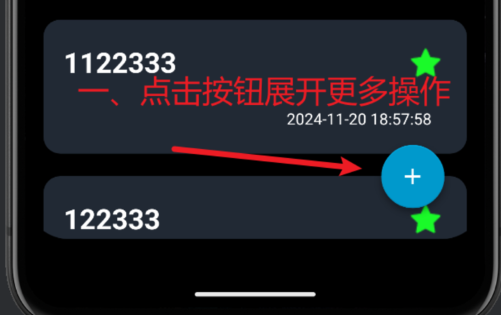
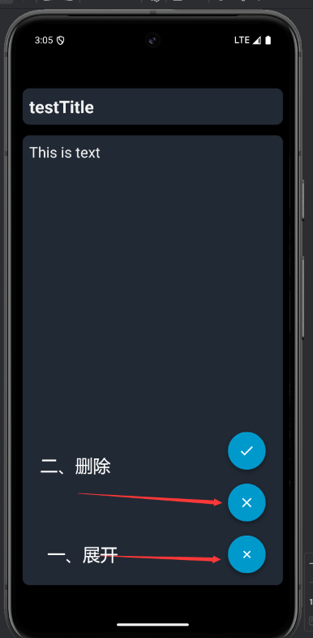
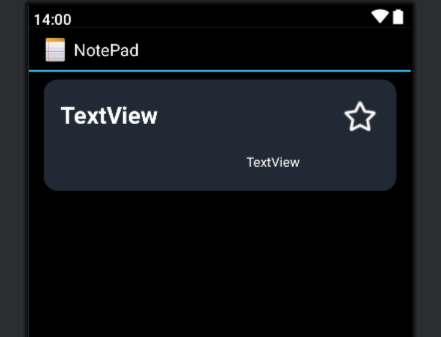

# Android_notePad 期中实验  
## 项目介绍

这是一个基于Android原生[NotePad](https://github.com/llfjfz/NotePad)应用程序进行功能扩展的笔记本应用。在保留原有的笔记创建、编辑、删除等基础功能上，增加了笔记分类、搜索、收藏等实用功能，并进行UI统一设计美化。  
## 项目结构
app/  
├── src/  
│ ├── main/  
│ │ ├── java/com/example/android/notepad/  
│ │ │ ├── NoteEditor.java		       # 笔记编辑界面  
│ │ │ ├── NotesList.java 			# 笔记列表界面  
│ │ │ ├── NotePadProvider.java	      # 数据访问提供者  
│ │ │ └── NotePad.java			  # 常量定义  
│ │ │ └── MyAdapter				# 自定义适配器  
│ │ ├── res/  
│ │ │ ├── layout/ # 界面布局文件  
│ │ │ ├── drawable/ # 图片资源  
│ │ │ ├── values/ # 资源文件  
│ │ │ └── menu/ # 菜单文件  
│ │ └── AndroidManifest.xml # 应用配置文件  
│ └── test/ # 测试代码目录  
└── build.gradle # 项目构建配置    

## 功能特点
- 基础功能
  - 创建笔记
  - 编辑笔记
  - 删除笔记
  - 查看笔记列表

- 扩展功能
  - 添加时间戳显示笔记最后修改时间
  - 支持批量删除笔记
  - 收藏笔记功能
    - 将笔记设置为收藏
    - 查看所有被收藏笔记
    - 查看分类中被收藏笔记
  - 笔记分类管理
    - 创建新分类
    - 为笔记设置分类
    - 按分类查看笔记
    - 删除分类所属笔记以及分类
  - 搜索笔记功能
    - 可以按标题对笔记进行搜索
    - 支持模糊搜索
  - 美化界面
    - 自定义对话框样式
    - 浮动按钮设计功能菜单
    - 简洁化UI设计
## 技术特点
  - 基于Android原生ContentProvider实现数据存储
  - 使用SQLite数据库
  - 使用CardView、FloatingActionButton等视图组件
## 数据库设计
### Notes表
| 列名 | 类型 | 说明 |
|:-----|------|------|
| _id | INTEGER | 主键 |
| title | TEXT | 笔记标题 |
| note | TEXT | 笔记内容 |
| created | INTEGER | 创建时间 |
| modified | INTEGER | 修改时间 |
| star | INTEGER | 收藏 |
| classify_name | TEXT | 分类名称 |

### Classify表
| 列名 | 类型 | 说明 |
|------|------|------|
| _id | INTEGER | 主键 |
| name | TEXT | 分类名称 |

## 使用说明
### 添加笔记  
- 图片演示  
    1. 展开功能栏
    2. 点击添加笔记按钮
    3. 编辑笔记
    4. 添加
    5. 首页  
      
       
       
       
      
### 删除笔记  
- 图片演示
    1. 点击进入笔记
    2. 点击展开功能列，并点击删除
    3. 首页  
      
      
### 时间戳
- 图片展示，每个笔记下都有一个时间戳，用来显示最近修改时间  
      
### 批量删除
- 图片演示
    1. 长按笔记
    2. 多选(当没有笔记被选中时，退出批量删除)
    3. 点击删除  
      
      
### 搜索笔记
- 图片演示
    1. 点击功能列表，点击搜索按钮，会从顶部弹出一个搜索框
    2. 在搜索框输入标题，支持模糊查询，如果输入为空，查询结果为所有笔记
    3. 点击搜索，展示查询到笔记  
      
      
       
### 收藏笔记
- 图片演示
    1. 点击收藏，点击已收藏笔记取消收藏
    2.  操作结果  
      
    
### 展示所有收藏笔记
- 图片演示
    1. 点击展开功能列表，点击我的收藏按钮
    2. 展示所有收藏笔记  
      
      
### 分类功能
- 首页展示分类文件夹
  1. 展开功能栏
  2. 点击展示分类，展示包含：分类名称、包含笔记数量
  3. 点击进入分类夹
  4. 页面展示该分类下所有笔记  
    
    
    
- 为笔记添加/修改所属分类
  1. 点开笔记
  2. 点开功能列表
  3. 点击分类
  4. 选择现有分类或添加新分类
  5. 保存笔记
  6. 返回分类视图，可以看到刚才添加的分类，里面有刚才的笔记  
    
     
    
    
- 删除分类及分类下所属所有笔记
 1. 在分类列表中长按分类
 2. 选中一个或多个分类
 3. 点击删除按钮进行删除分类以及分类下所有笔记  
  
  
  
  

## note_pad应用相关代码说明
### 数据结构相关
#### 建表语句
```java
@Override
public void onCreate(SQLiteDatabase db) {
db.execSQL("CREATE TABLE " + NotePad.Notes.TABLE_NAME + " ("
           + NotePad.Notes._ID + " INTEGER PRIMARY KEY,"
           + NotePad.Notes.COLUMN_NAME_TITLE + " TEXT,"
           + NotePad.Notes.COLUMN_NAME_NOTE + " TEXT,"
           + NotePad.Notes.COLUMN_NAME_CREATE_DATE + " INTEGER,"
           + NotePad.Notes.COLUMN_NAME_MODIFICATION_DATE + " INTEGER,"
           + NotePad.Notes.COLUMN_NAME_STAR + " INTEGER DEFAULT 0,"    // 新增收藏字段，默认为0，未被收藏
           + NotePad.Notes.COLUMN_NAME_CLASSIFY_NAME + " TEXT" // 新增分类字段
           + ");");

// 创建 classify 表
db.execSQL("CREATE TABLE " + NotePad.Classify.TABLE_NAME + " ("
           + NotePad.Classify._ID + " INTEGER PRIMARY KEY AUTOINCREMENT,"
           + NotePad.Classify.COLUMN_NAME_NAME + " TEXT UNIQUE NOT NULL"
           + ");");
}
```

####  基础数据结构
```java
public final class NotePad {
    public static final class Notes implements BaseColumns {
        //...
        
         /**
         *  收藏字段
         *  <p>0 -> 未收藏
         *     1 -> 收藏
         *  </p>
         */
        public static final String COLUMN_NAME_STAR = "star";

        /**
         * 分类
         */
        public static final String COLUMN_NAME_CLASSIFY_NAME = "classify_name";
        
        //...
    }
    public static final class Classify implements BaseColumns {

        private Classify() {}

        public static final String TABLE_NAME = "classify";

        public static final String COLUMN_NAME_NAME = "name";

        public static final String DEFAULT_SORT_ORDER = "name ASC";

        // URI 定义
        private static final String PATH_CLASSIFY = "/classify";
        public static final Uri CONTENT_URI =
                Uri.parse("content://" + AUTHORITY + PATH_CLASSIFY);

        public static final String CONTENT_TYPE =
                "vnd.android.cursor.dir/vnd.google.classify";
        public static final String CONTENT_ITEM_TYPE =
                "vnd.android.cursor.item/vnd.google.classify";
    }
}
```

在 NotePad.java 中修改数据结构，为 notes 添加 star 用来表示笔记是否被收藏，添加 classify_name 字段用来表示笔记所属分类，并新增一个 classify 表。

然后修改 NotePadProvider.java ，更新建表语句，并修改相关的数据库操作代码

### UI 相关
#### 将应用主题设置为无顶部操作栏形式
```java
<activity android:name="NotesList"
            android:theme="@android:style/Theme.Holo.NoActionBar">
            ...
        </activity>
```

#### listItem 统一样式处理
+ 相关组件引入

```yaml
dependencies {
  // card布局
  implementation 'androidx.cardview:cardview:1.0.0'
  ...
}
```

+ 修改 notelist_item.xml，使用卡片布局包裹列表项，设置圆角，透明度内外边距等，并进行 UI 颜色的统一  `#CC2a3441`

```xml
<androidx.cardview.widget.CardView
  android:id="@+id/cardView"
  android:layout_width="match_parent"
  android:layout_height="120dp"
  android:layout_marginStart="16dp"
  android:layout_marginEnd="16dp"
  android:layout_marginTop="8dp"
  android:layout_marginBottom="8dp"
  app:cardBackgroundColor="#CC2a3441"
  app:contentPaddingTop="5dp"
  app:contentPaddingLeft="2dp"
  app:contentPaddingRight="5dp"
  ...
</androidx.cardview.widget.CardView>

```

+ 图片示意  

  

分类的列表 item 同理

#### 笔记编辑界面修改
这里同样使用 cardview 进行处理，用两个 careview 组件包装 editText，分别处理笔记标题的修改和正文的编写。

+ 示意图  

  

#### 功能栏样式统一
因为本项目中取消了顶部功能栏的显示，所以使用 floatingactionbutton 组件来装配各个功能按钮

+ 组件引入

```yaml
dependencies {
  ...
  // 浮动按钮
  implementation 'com.getbase:floatingactionbutton:1.10.1'
}
```

+ 新增 notelist_main.xml，用来装载 listItem,部分代码如下

```xml
...
<com.getbase.floatingactionbutton.FloatingActionsMenu
  android:id="@+id/fab_menu"
  android:layout_width="wrap_content"
  android:layout_height="wrap_content"
  android:layout_alignParentStart="true"
  android:layout_alignParentBottom="true"
  android:layout_marginStart="310dp"
  android:layout_marginBottom="16dp"
  app:fab_addButtonSize="normal">

  <com.getbase.floatingactionbutton.FloatingActionButton
    android:layout_width="wrap_content"
    android:layout_height="wrap_content"
    android:layout_alignParentStart="true"
    android:layout_alignParentBottom="true"
    android:layout_marginStart="326dp"
    android:layout_marginBottom="12dp"
    android:id="@+id/show_classify"
    app:fab_icon="@drawable/android_classify"
    app:fab_size="normal"
    tools:ignore="TouchTargetSizeCheck,SpeakableTextPresentCheck"></com.getbase.floatingactionbutton.FloatingActionButton>

  <!-- ... 其他按钮   -->


</com.getbase.floatingactionbutton.FloatingActionsMenu>
...
```

+ 效果示意图

未展开状态  

  

展开状态  

   

+ 笔记编辑页面操作按钮做相似处理，不再展示

#### dialog 对话框样式自定义
添加 add_classify_dialog.xml 和 classify_dialog.xml 用于添加笔记分类时的对话框展示，统一对话框 UI 样式

+ 图片展示  

  

  

### 功能相关
#### 笔记显示
```java
@Override
protected void onCreate(Bundle savedInstanceState) {
    super.onCreate(savedInstanceState);
    // 初始化标志
    isInClassifyNotes = false;
    currentClassifyName = null;
    // list布局加载
    setContentView(R.layout.notelist_main);
    
    getListView().setOnCreateContextMenuListener(this);

    // ...

    final Cursor[] cursor = {managedQuery(
        getIntent().getData(),            // Use the default content URI for the provider.
        PROJECTION,                       // Return the note ID and title for each note.
        null,                             // No where clause, return all records.
        null,                             // No where clause, therefore no where column values.
        NotePad.Notes.DEFAULT_SORT_ORDER  // Use the default sort order.
    )};
    
    String[] dataColumns = { NotePad.Notes.COLUMN_NAME_TITLE,
                             COLUMN_NAME_MODIFICATION_DATE } ;
    
    // The view IDs that will display the cursor columns, initialized to the TextView in
    int[] viewIDs = { R.id.textTitle,
                      R.id.textDate};
    
    // Creates the backing adapter for the ListView.
    final MyAdapter adapter
    = new MyAdapter(
        this,                             // The Context for the ListView
        R.layout.notelist_item4,          // Points to the XML for a list item
        cursor[0],                           // The cursor to get items from
        dataColumns,
        viewIDs,
        false
    );
    
    // Sets the ListView's adapter to be the cursor adapter that was just created.
    setListAdapter(adapter);

    // ...

    // 事件戳
    timeShow(adapter);
}
```

使用`setContentView(R.layout.notelist_main);`应用自定义 ListView 布局,

并编写 Myadapter 类，继承 SimpleCursorAdapter ，用来渲染列表项，相关代码如下

```java
public class MyAdapter extends SimpleCursorAdapter {
    private SparseBooleanArray selectedItems;
    private Context context; // 保存context
    private boolean isClassifyView; // 添加标志来区分是否是分类视图
    public MyAdapter(Context context, int layout, Cursor c, String[] from, int[] to, boolean isClassifyView) {
        super(context, layout, c, from, to);
        this.context = context;
        this.isClassifyView = isClassifyView;
        selectedItems = new SparseBooleanArray();
    }

    @Override
    public View getView(int position, View convertView, ViewGroup parent) {
        // ...
    }

    private void handleFavoriteButtonClick(final ImageView favoriteButton, final int position) {
        // ...
    }

    // 设置选中项
    public void setItemSelected(int position, boolean selected) {
        // ...
    }

    // 清空选中项
    public void clearSelection() {
       // ...
    }
}
```

编写时间戳显示方法

```java
private static void timeShow(MyAdapter adapter) {
// 设置自定义视图绑定器，用于修改时间格式显示。这里使用内部类来实现SimpleCursorAdapter.ViewBinder接口。
adapter.setViewBinder(new SimpleCursorAdapter.ViewBinder() {
    @Override
    public boolean setViewValue(View view, Cursor cursor, int columnIndex) {
        // 检查视图是否是TextView类型，因为我们要修改的是文本显示。
        if (view instanceof TextView) {
            // 获取当前列的列名，以便判断是否需要特殊处理。
            String columnName = cursor.getColumnName(columnIndex);

            // 判断当前列是否是修改日期列（假设NotePad.Notes.COLUMN_NAME_MODIFICATION_DATE是修改日期的列名）。
            if (columnName.equals(NotePad.Notes.COLUMN_NAME_MODIFICATION_DATE)) {
                // 从Cursor中获取修改日期的时间戳（毫秒为单位）。
                long dateInMillis = cursor.getLong(columnIndex);

                // 将视图转换为TextView，以便设置文本。
                TextView textView = (TextView) view;

                // 创建一个SimpleDateFormat对象，用于格式化日期。这里使用"yyyy-MM-dd HH:mm:ss"格式，并指定默认语言环境。
                SimpleDateFormat dateFormat = new SimpleDateFormat("yyyy-MM-dd HH:mm:ss", Locale.getDefault());

                // 使用SimpleDateFormat格式化时间戳，并将结果设置为TextView的文本。
                textView.setText(dateFormat.format(new Date(dateInMillis)));

                // 返回true表示我们已经处理了该视图的值，不需要进一步处理。
                return true;
            }
        }

        // 如果视图不是TextView或者当前列不是修改日期列，返回false表示我们没有处理该视图的值，可能需要其他处理。
        return false;
    }
});
}
```

#### 搜索功能
在 notelist_main.xml 文件中编写了搜索框的相关布局，并设置`android:translationY="-100dp"`将其隐藏于顶部。

在 NoteList.java 中编写`searchNote`函数提供搜索相关功能，并在 oncreate 函数中调用。

主要是维护了 boolean 类型的 final 变量`isSearchVisible`，用作标识搜索框是否展示，并为搜索按钮绑定点击事件，点击时搜索框下移显示。

```java
// 搜索框下滑动画
searchLayout.animate()
    .translationY(0)
    .setDuration(300)
    .start();

// ListView下移动画
listView.animate()
    .translationY(searchLayout.getHeight())
    .setDuration(300)
    .start();
```

对用户的输入进行查询以及查询结果的显示

```java
// ...
Cursor cursor = getContentResolver().query(
    getIntent().getData(),
    PROJECTION,
    NotePad.Notes.COLUMN_NAME_TITLE + " LIKE ?",
    new String[]{"%" + searchString + "%"},
    NotePad.Notes.DEFAULT_SORT_ORDER
);
String[] dataColumns = {NotePad.Notes.COLUMN_NAME_TITLE, COLUMN_NAME_MODIFICATION_DATE};
                int[] viewIDs = {R.id.textTitle, R.id.textDate};
                MyAdapter adapter = new MyAdapter(
                        NotesList.this,
                        R.layout.notelist_item4,
                        cursor,
                        dataColumns,
                        viewIDs,
                        false
                );
                setListAdapter(adapter);
// ...
```

#### 收藏功能
首先在 notelist.java 中维护了一个 boolean 类型的 final 变量 `isShowingFavorites`，用来标识当前是否展示的是被收藏的笔记。编写方法 `showStaredNotes`处理展示收藏笔记的功能。

主要代码片段：

```java
cursor[0] = managedQuery(
    getIntent().getData(),
    PROJECTION,
    NotePad.Notes.COLUMN_NAME_STAR + "=?",
    new String[]{"1"},
    NotePad.Notes.DEFAULT_SORT_ORDER
);
```

添加条件，查询被收藏的笔记，并更新适配器`adapter.changeCursor(cursor[0]);`

其中，方法`showStaredNotes`的入参需要注意，包含`final Cursor[] cursor, final MyAdapter adapter, final String currentClassifyName`，`currentClassifyName`是一个全局变量，用来记录当前选择的分类名（如果有），当`currentClassifyName`不为空时，需要改变查询条件，查询该分类下的被收藏笔记

```java
String selection = NotePad.Notes.COLUMN_NAME_STAR + "=? AND "
+ NotePad.Notes.COLUMN_NAME_CLASSIFY_NAME + "=?";
String[] selectionArgs = new String[]{"1", currentClassifyName};

cursor[0] = getContentResolver().query(
    getIntent().getData(),
    PROJECTION,
    selection,
    selectionArgs,
    NotePad.Notes.DEFAULT_SORT_ORDER
);
```

点击收藏功能定义在自定义适配器的`handleFavoriteButtonClick`方法中，部分代码如下：

```java
//...
// 设置点击事件
favoriteButton.setOnClickListener(new View.OnClickListener() {
    @Override
    public void onClick(View v) {
        int newStarStatus = (isFavorite == 1) ? 0 : 1;

        if (newStarStatus == 1) {
            favoriteButton.setImageResource(R.drawable.android_star);
        } else {
            favoriteButton.setImageResource(R.drawable.android_notstar);
        }

        ContentValues values = new ContentValues();
        values.put(NotePad.Notes.COLUMN_NAME_STAR, newStarStatus);
        Uri updateUri = ContentUris.withAppendedId(NotePad.Notes.CONTENT_URI, noteId);
        context.getContentResolver().update(updateUri, values, null, null);

        notifyDataSetChanged();
    }
});
// ...
```

#### 分类功能
+ 分类展示列表

系统维护一个 `isShowingClassify`boolean 变量用来标识当前展示的时分类列表还是笔记列表，为展示分类安钮绑定点击事件

```java
private void toggleView() {
    if (isShowingClassify) {
        // 切换到笔记视图
        showNotes();
    } else {
        // 切换到分类视图
        showClassify();
    }
}
```

其中展示笔记方法中，需要重新设置光标以及适配器。

`showClassify`部分代码,方法中也需要重新创建适配器，并增加列表项点击事件

```java
// ...
// 查询所有分类
Cursor classifyCursor = getContentResolver().query(
    NotePad.Classify.CONTENT_URI,
    new String[]{NotePad.Classify._ID, NotePad.Classify.COLUMN_NAME_NAME},
    null,
    null,
    NotePad.Classify.DEFAULT_SORT_ORDER
);

// 创建一个新的 MatrixCursor 来存储带有笔记数量的分类数据
String[] columns = new String[]{
    NotePad.Classify._ID,
    NotePad.Classify.COLUMN_NAME_NAME,
    "note_count" // 添加笔记数量列
};
MatrixCursor matrixCursor = new MatrixCursor(columns);

if (classifyCursor != null && classifyCursor.moveToFirst()) {
    do {
        long classifyId = classifyCursor.getLong(
            classifyCursor.getColumnIndex(NotePad.Classify._ID));
        String classifyName = classifyCursor.getString(
            classifyCursor.getColumnIndex(NotePad.Classify.COLUMN_NAME_NAME));

        // 查询该分类下的笔记数量
        Cursor notesCountCursor = getContentResolver().query(
            NotePad.Notes.CONTENT_URI,
            new String[]{"COUNT(*) AS count"},
            NotePad.Notes.COLUMN_NAME_CLASSIFY_NAME + "=?",
            new String[]{classifyName},
            null
        );

        int noteCount = 0;
        if (notesCountCursor != null && notesCountCursor.moveToFirst()) {
            noteCount = notesCountCursor.getInt(0);
            notesCountCursor.close();
        }

        // 将数据添加到 MatrixCursor
        matrixCursor.addRow(new Object[]{classifyId, classifyName, noteCount});
    } while (classifyCursor.moveToNext());
    classifyCursor.close();
}
// ...
```

+ 分类管理列表

在笔记编辑页面`NoteEditor.java`中，为分类按钮绑定点击事件，调用选择分类对话框方法 `showClassifyDialog`

其中，对话框使用了 `AlertDialog`，并绑定自定义样式：

```java
AlertDialog.Builder builder = new AlertDialog.Builder(this, R.style.dialog_style);
View dialogView = getLayoutInflater().inflate(R.layout.classify_dialog, null);
```

首先需要查询所有分类，并将其显示到对话框中

```java
// ...
// 查询所有分类
Cursor cursor = getContentResolver().query(
    NotePad.Classify.CONTENT_URI,
    new String[]{NotePad.Classify.COLUMN_NAME_NAME},
    null,
    null,
    NotePad.Classify.DEFAULT_SORT_ORDER
);
final List<String> classifyList = new ArrayList<>();
if (cursor != null && cursor.moveToFirst()) {
    do {
        classifyList.add(cursor.getString(0));
    } while (cursor.moveToNext());
    cursor.close();
}
// 设置适配器
ArrayAdapter<String> adapter = new ArrayAdapter<>(this,
                                                  android.R.layout.simple_list_item_single_choice,
                                                  classifyList);
listView.setAdapter(adapter);
listView.setChoiceMode(ListView.CHOICE_MODE_SINGLE);
// ...
```

选择所属分类后调用方法

```java
// 更新笔记分类
private void updateNoteClassify(String classify) {
ContentValues values = new ContentValues();
values.put(NotePad.Notes.COLUMN_NAME_CLASSIFY_NAME, classify);
getContentResolver().update(mUri, values, null, null);
Toast.makeText(this, "已更新分类: " + classify, Toast.LENGTH_SHORT).show();
}
```

然后为添加分类按钮绑定执行逻辑，主要代码如下：

```java
// ...
btnConfirm.setOnClickListener(new View.OnClickListener() {
    @Override
    public void onClick(View v) {
        String newClassify = editClassifyName.getText().toString().trim();
        if (!TextUtils.isEmpty(newClassify)) {
            ContentValues values = new ContentValues();
            values.put(NotePad.Classify.COLUMN_NAME_NAME, newClassify);
            try {
                getContentResolver().insert(NotePad.Classify.CONTENT_URI, values);
                updateNoteClassify(newClassify);
                dialog.dismiss();
            } catch (SQLException e) {
                Toast.makeText(NoteEditor.this, "该分类已存在", Toast.LENGTH_SHORT).show();
            }
        }
    }
});
// ...
```

#### 批量删除
在 NoteList.java 中自定义 listview 的多选模式

```java
final ListView listView = getListView();
setupMultiChoiceMode(adapter); // 设置多选模式
```

```java
private void setupMultiChoiceMode(final MyAdapter adapter) {
    final ListView listView = getListView();
    listView.setChoiceMode(ListView.CHOICE_MODE_MULTIPLE_MODAL);

    listView.setMultiChoiceModeListener(new AbsListView.MultiChoiceModeListener() {
        @Override
        public void onItemCheckedStateChanged(ActionMode mode, int position, long id, boolean checked) {
            adapter.setItemSelected(position, checked);

            int checkedCount = listView.getCheckedItemCount();
            if (checkedCount > 0) {
                findViewById(R.id.delete_notes).setVisibility(View.VISIBLE);
            } else {
                findViewById(R.id.delete_notes).setVisibility(View.GONE);
            }

            mode.setTitle(checkedCount + " selected");
        }

        // ...
        
        @Override
        public void onDestroyActionMode(ActionMode mode) {
            adapter.clearSelection();
            findViewById(R.id.delete_notes).setVisibility(View.GONE);
        }
    });
}
```

其中，删除按钮只有存在选中项时才会出现

在 MyAdapter 中编写方法，保存选中项

```java
// 设置选中项
public void setItemSelected(int position, boolean selected) {
    if (selected) {
        selectedItems.put(position, true);
    } else {
        selectedItems.delete(position);
    }
    notifyDataSetChanged(); // 刷新列表视图
}
```

并重写 getView 方法，设置 item 被选中时的展示样式

```java
@Override
public View getView(int position, View convertView, ViewGroup parent) {
    View view = super.getView(position, convertView, parent);

    // 获取每个 CardView
    CardView cardView = (CardView) view.findViewById(R.id.cardView);

    // 根据选中状态更改背景颜色
    if (selectedItems.get(position, false)) {
        cardView.setCardBackgroundColor(view.getContext().getResources().getColor(R.color.selected_color));
    } else {
        cardView.setCardBackgroundColor(view.getContext().getResources().getColor(R.color.default_color));
    }
    // 只在笔记视图中处理收藏按钮
    if (!isClassifyView) {
        ImageView favoriteButton = (ImageView) view.findViewById(R.id.favoriteButton);
        if (favoriteButton != null) {
            handleFavoriteButtonClick(favoriteButton, position);
        }
    }
    return view;
}
```

最后为删除按钮绑定点击事件

```java
// 设置删除按钮点击事件
fabDelete.setOnClickListener(new View.OnClickListener() {
    @Override
    public void onClick(View v) {
        SparseBooleanArray checkedItems = listView.getCheckedItemPositions();
        for (int i = 0; i < checkedItems.size(); i++) {
            int position = checkedItems.keyAt(i);
            if (checkedItems.valueAt(i)) {
                Cursor selectedCursor = (Cursor) adapter.getItem(position);
                long noteId = selectedCursor.getLong(selectedCursor.getColumnIndex(NotePad.Notes._ID));
                Uri uri = ContentUris.withAppendedId(NotePad.Notes.CONTENT_URI, noteId);
                getContentResolver().delete(uri, null, null);
            }
        }
        adapter.clearSelection(); // 清空选中状态
        fabDelete.setVisibility(View.GONE);
    }
});
```


